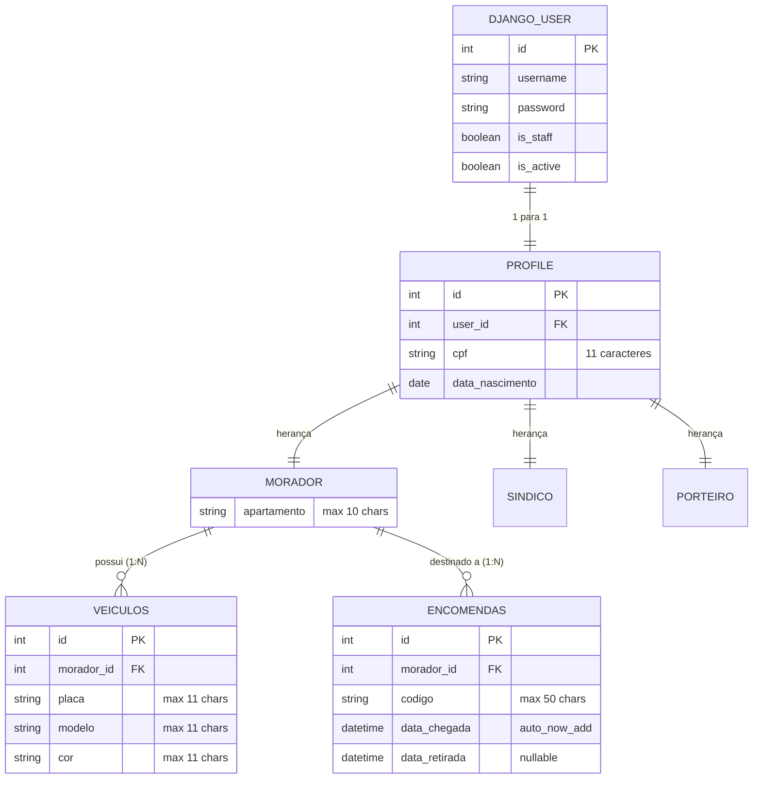

# API & ARQUITETURA DO PROJETO: O SEU SÍNDICO
> **Finalidade do Documento:** Base de conhecimento exaustiva e estruturada para indexação vetorial (RAG) e geração automatizada de aplicações Front-End (React, Next.js, Vue ou Flutter).
> **Versão da API:** 1.0.0
> **Tecnologias Backend:** Python 3.14, Django 6.1.1, Django REST Framework 3.18.1, SimpleJWT 5.5.1, drf-spectacular, PostgreSQL.

---

## 1. VISÃO GERAL DO SISTEMA

### 1.1 Objetivo do Domínio
O sistema **O Seu Síndico** é uma plataforma de gestão condominial voltada para a modernização da portaria, controle de fluxo de encomendas, gestão de moradores e identificação veicular para controle de acesso às vagas.

### 1.2 Perfis de Usuário (Roles & Permissions)
O sistema opera com dois níveis operacionais de acesso:
1. **Administração / Portaria / Síndico (`is_staff = True`)**:
   - Cadastro e edição de moradores.
   - Cadastro, consulta rápida (por placa/apartamento) e exclusão de veículos.
   - Recebimento e registro de encomendas na portaria.
   - Baixa de retirada de encomendas de qualquer morador.
2. **Morador Comum (`is_staff = False`)**:
   - Acesso aos seus dados de perfil vinculados (`/api/moradores/me/`).
   - Visualização restrita e filtrada apenas das encomendas destinadas ao seu próprio apartamento.

### 1.3 Convenções Gerais de Comunicação
- **URL Base Local:** `http://localhost:8000`
- **Host de Produção/Deploy:** `http://54.89.94.139` (Porta 8000)
- **Headers Padrão:**
  - `Content-Type: application/json`
  - `Accept: application/json`
  - `Authorization: Bearer <access_token>` (para rotas protegidas)
- **CORS:** Configurado para `CORS_ALLOW_ALL_ORIGINS = True` no backend.

---

## 2. MECANISMO DE AUTENTICAÇÃO E SESSÃO (JWT)

A autenticação é gerenciada via **SimpleJWT** com tempo de vida de token configurado:
- **Access Token:** Validade de **60 minutos** (usado no header `Authorization: Bearer <token>`).
- **Refresh Token:** Validade de **1 dia** (usado para gerar um novo token de acesso sem reautenticar).

### 2.1 Obter Tokens (Login)
- **Rota:** `POST /api/token/`
- **Autenticação Requerida:** Nenhuma (Pública)
- **Headers:** `Content-Type: application/json`
- **Payload de Requisição:**
```json
{
  "username": "usuario_login",
  "password": "senha_do_usuario"
}
```
- **Resposta Sucesso (200 OK):**
```json
{
  "access": "eyJhbGciOiJIUzI1NiIsInR5cCI6IkpXVCJ9...",
  "refresh": "eyJhbGciOiJIUzI1NiIsInR5cCI6IkpXVCJ9..."
}
```
- **Resposta Erro (401 Unauthorized):**
```json
{
  "detail": "No active account found with the given credentials"
}
```

### 2.2 Renovar Access Token (Refresh)
- **Rota:** `POST /api/token/refresh/`
- **Autenticação Requerida:** Nenhuma
- **Payload de Requisição:**
```json
{
  "refresh": "eyJhbGciOiJIUzI1NiIsInR5cCI6IkpXVCJ9..."
}
```
- **Resposta Sucesso (200 OK):**
```json
{
  "access": "eyJhbGciOiJIUzI1NiIsInR5cCI6IkpXVCJ9..."
}
```

---

## 3. MODELOS DE DADOS E RELACIONAMENTOS

### 3.1 Diagrama de Entidade-Relacionamento (ERD)



### 3.2 Especificação dos Campos

| Entidade | Campo | Tipo | Nulo/Vazio | Descrição / Regra |
|---|---|---|---|---|
| **Morador** | `id` | Integer | Não (Auto PK) | Identificador único do morador |
| | `username` | String | Não | Nome de usuário único no Django User (write_only na API) |
| | `password` | String | Não | Senha de acesso encriptada (write_only na API) |
| | `cpf` | String (11) | Sim (`blank=True`) | CPF sem formatação ou com dígitos |
| | `data_nascimento` | Date (`YYYY-MM-DD`) | Não | Data de nascimento do morador |
| | `apartamento` | String (10) | Não | Número/Bloco da unidade (Ex: "A102", "304B") |
| **Veiculos** | `id` | Integer | Não (Auto PK) | Identificador do veículo |
| | `morador` | Integer (FK) | Não | ID do Morador associado (`on_delete=CASCADE`) |
| | `placa` | String (11) | Não | Placa do veículo (Ex: "ABC-1234", "BRA2E19") |
| | `modelo` | String (11) | Não | Modelo do carro/moto (Ex: "Civic", "Sandero") |
| | `cor` | String (11) | Não | Cor predominante (Ex: "Preto", "Prata") |
| **Encomendas** | `id` | Integer | Não (Auto PK) | Identificador da encomenda |
| | `morador` | Integer (FK) | Não | ID do Morador destinatário (`on_delete=DO_NOTHING`) |
| | `codigo` | String (50) | Não | Código de rastreio ou número do pacote |
| | `data_chegada` | DateTime (ISO 8601)| Não (Auto) | Preenchido automaticamente na criação |
| | `data_retirada` | DateTime (ISO 8601)| Sim | Preenchido quando o morador retira o pacote |

---

## 4. CATÁLOGO COMPLETO DE ROTAS E ENDPOINTS (API SPEC)

### 4.1 Módulo: Contas & Moradores (`accounts`)

#### 4.1.1 Obter Perfil do Usuário Autenticado
- **Método & Endpoint:** `GET /api/moradores/me/`
- **Permissão:** `IsAuthenticated` (Bearer Token)
- **Uso Frontend:** Chamada inicial logo após o login para obter dados do morador logado e personalizar a interface.
- **Resposta Sucesso (200 OK):**
```json
{
  "id": 1,
  "cpf": "12345678900",
  "data_nascimento": "1992-08-15",
  "apartamento": "C302"
}
```
- **Resposta Erro (404 Not Found):**
```json
{
  "erro": "Perfil de morador não encontrado para este usuário."
}
```

#### 4.1.2 Listar Moradores
- **Método & Endpoint:** `GET /moradores/`
- **Permissão:** Aberta / Portaria
- **Paginação:** Padrão DRF (`page_size = 5`).
- **Parâmetros de Consulta (Query Params):**
  - `page`: Número da página (ex: `?page=1`)
  - `cpf`: Busca exata por CPF (ex: `?cpf=12345678900`)
  - `apartamento`: Busca pelo número do apartamento (ex: `?apartamento=C302`)
- **Resposta Sucesso (200 OK):**
```json
{
  "count": 12,
  "next": "http://localhost:8000/moradores/?page=2",
  "previous": null,
  "results": [
    {
      "id": 1,
      "cpf": "12345678900",
      "data_nascimento": "1992-08-15",
      "apartamento": "C302"
    }
  ]
}
```

#### 4.1.3 Criar Morador
- **Método & Endpoint:** `POST /moradores/`
- **Headers:** `Content-Type: application/json`
- **Payload de Requisição:**
```json
{
  "username": "joao_silva",
  "password": "senha_segura_123",
  "cpf": "12345678900",
  "data_nascimento": "1992-08-15",
  "apartamento": "C302"
}
```
- **Resposta Sucesso (201 Created):**
```json
{
  "mensagem": "Morador criado com sucesso!",
  "dados": {
    "id": 1,
    "cpf": "12345678900",
    "data_nascimento": "1992-08-15",
    "apartamento": "C302"
  }
}
```
- **Resposta Erro (400 Bad Request):**
```json
{
  "username": ["A user with that username already exists."],
  "apartamento": ["This field may not be blank."]
}
```

#### 4.1.4 Atualizar Morador
- **Método & Endpoint:** `PUT /moradores/<int:pk>/`
- **Headers:** `Content-Type: application/json`
- **Payload de Requisição:**
```json
{
  "username": "joao_silva_atualizado",
  "password": "nova_senha_opcional",
  "cpf": "12345678900",
  "data_nascimento": "1992-08-15",
  "apartamento": "B302"
}
```
- **Resposta Sucesso (200 OK):**
```json
{
  "Mensagem": "Morador atualizado com sucesso",
  "dados": {
    "id": 1,
    "cpf": "12345678900",
    "data_nascimento": "1992-08-15",
    "apartamento": "B302"
  }
}
```
- **Resposta Erro (404 Not Found):**
```json
{
  "Erro": "Morador não encontrado"
}
```

#### 4.1.5 Deletar Morador
- **Método & Endpoint:** `DELETE /moradores/<int:pk>/`
- **Comportamento:** Remove o registro do usuário Django e deleta em cascata o perfil de morador.
- **Resposta Sucesso:** `204 No Content` (sem corpo de resposta)
- **Resposta Erro (404 Not Found):**
```json
{
  "Erro": "Morador não encontrado"
}
```

---

### 4.2 Módulo: Gestão de Veículos (`veiculos`)
> **Nota de Acesso:** Todos os endpoints de veículos exigem token de usuário Staff (`IsAuthenticated` + `IsAdminUser`).

#### 4.2.1 Listar Veículos
- **Método & Endpoint:** `GET /veiculos/`
- **Permissão:** `IsAuthenticated`, `IsAdminUser`
- **Paginação:** Padrão DRF (`page_size = 5`).
- **Filtros (Query Params):**
  - `page`: Número da página (ex: `?page=1`)
  - `placa`: Busca parcial insensível a maiúsculas/minúsculas (ex: `?placa=QSX`)
  - `morador`: ID do morador proprietário (ex: `?morador=2`)
  - `apartamento`: Busca pelo apartamento do dono (ex: `?apartamento=204A`)
- **Resposta Sucesso (200 OK):**
```json
{
  "count": 1,
  "next": null,
  "previous": null,
  "results": [
    {
      "id": 1,
      "morador": 2,
      "placa": "QSX-1876",
      "modelo": "Sandero",
      "cor": "Prata"
    }
  ]
}
```

#### 4.2.2 Cadastrar Veículo
- **Método & Endpoint:** `POST /veiculos/`
- **Permissão:** `IsAuthenticated`, `IsAdminUser`
- **Payload de Requisição:**
```json
{
  "morador": 2,
  "placa": "QSX-1876",
  "modelo": "Sandero",
  "cor": "Prata"
}
```
- **Resposta Sucesso (201 Created):**
```json
{
  "Mensagem": "Veículo cadastrado com sucesso",
  "Dados": {
    "id": 1,
    "morador": 2,
    "placa": "QSX-1876",
    "modelo": "Sandero",
    "cor": "Prata"
  }
}
```

#### 4.2.3 Detalhar Veículo
- **Método & Endpoint:** `GET /veiculos/<int:pk>/`
- **Permissão:** `IsAuthenticated`, `IsAdminUser`
- **Resposta Sucesso (200 OK):**
```json
{
  "id": 1,
  "morador": 2,
  "placa": "QSX-1876",
  "modelo": "Sandero",
  "cor": "Prata"
}
```

#### 4.2.4 Atualizar Veículo
- **Método & Endpoint:** `PUT /veiculos/<int:pk>/`
- **Permissão:** `IsAuthenticated`, `IsAdminUser`
- **Payload de Requisição:**
```json
{
  "morador": 2,
  "placa": "QSX-1876",
  "modelo": "Sandero",
  "cor": "Preto"
}
```
- **Resposta Sucesso (200 OK):**
```json
{
  "Mensagem": "Veículo atualizado com sucesso!"
}
```

#### 4.2.5 Excluir Veículo
- **Método & Endpoint:** `DELETE /veiculos/<int:pk>/`
- **Permissão:** `IsAuthenticated`, `IsAdminUser`
- **Resposta Sucesso:** `204 No Content`

---

### 4.3 Módulo: Encomendas e Portaria (`encomendas`)

#### 4.3.1 Listar Encomendas
- **Método & Endpoint:** `GET /encomendas/`
- **Permissão:** `IsAuthenticated`
- **Lógica de Visibilidade Backend:**
  - Se `request.user.is_staff`: Lista **todas** as encomendas do condomínio.
  - Se usuário for morador comum: Lista **apenas** as encomendas do próprio morador logado.
- **Paginação:** Padrão DRF (`page_size = 10`).
- **Filtros (Query Params):**
  - `page`: Número da página (ex: `?page=1`)
  - `codigo`: Código de rastreio (busca exata case-insensitive, ex: `?codigo=BR123456789BR`)
  - `retirada`: Filtro por estado de entrega:
    - `?retirada=false`: Apenas encomendas aguardando retirada na portaria.
    - `?retirada=true`: Apenas encomendas já retiradas pelo morador.
- **Resposta Sucesso (200 OK):**
```json
{
  "count": 1,
  "next": null,
  "previous": null,
  "results": [
    {
      "id": 1,
      "codigo": "BR123456789BR",
      "morador": 3,
      "data_chegada": "2026-09-29T20:00:00Z",
      "data_retirada": null
    }
  ]
}
```

#### 4.3.2 Registrar Nova Encomenda
- **Método & Endpoint:** `POST /encomendas/`
- **Permissão:** `IsAuthenticated` (Exclusivo para Portaria / `is_staff = True`)
- **Regra de Negócio:** Moradores recebem status `403 Forbidden` (`{"Erro": "Apenas portaria pode registrar."}`) caso tentem postar nesta rota.
- **Payload de Requisição:**
```json
{
  "codigo": "BR987654321BR",
  "morador": 3
}
```
- **Resposta Sucesso (201 Created):**
```json
{
  "mensagem": "Encomenda registrada com sucesso!",
  "dados": {
    "id": 2,
    "codigo": "BR987654321BR",
    "morador": 3,
    "data_chegada": "2026-09-29T20:45:10Z",
    "data_retirada": null
  }
}
```

#### 4.3.3 Detalhar Encomenda
- **Método & Endpoint:** `GET /encomendas/<int:pk>/`
- **Permissão:** `IsAuthenticated` (Staff ou Morador dono da encomenda)
- **Resposta Sucesso (200 OK):**
```json
{
  "id": 2,
  "codigo": "BR987654321BR",
  "morador": 3,
  "data_chegada": "2026-09-29T20:45:10Z",
  "data_retirada": null
}
```
- **Resposta Erro (404 Not Found):**
```json
{
  "erro": "Encomenda não encontrada ou você não tem permissão para vê-la."
}
```

#### 4.3.4 Atualizar / Dar Baixa em Encomenda
- **Método & Endpoint:** `PUT /encomendas/<int:pk>/`
- **Permissão:** `IsAuthenticated` (Staff ou Morador dono)
- **Uso Frontend Principal:** Dar baixa na entrega da encomenda inserindo o timestamp de `data_retirada`.
- **Payload de Requisição:**
```json
{
  "codigo": "BR987654321BR",
  "morador": 3,
  "data_retirada": "2026-09-29T22:15:00Z"
}
```
- **Resposta Sucesso (200 OK):**
```json
{
  "mensagem": "Atualizado!",
  "dados": {
    "id": 2,
    "codigo": "BR987654321BR",
    "morador": 3,
    "data_chegada": "2026-09-29T20:45:10Z",
    "data_retirada": "2026-09-29T22:15:00Z"
  }
}
```

#### 4.3.5 Excluir Encomenda
- **Método & Endpoint:** `DELETE /encomendas/<int:pk>/`
- **Permissão:** `IsAuthenticated` (Staff)
- **Resposta Sucesso:** `204 No Content`

---

## 5. DOCUMENTAÇÃO TÉCNICA E SWAGGER

O projeto possui integração com OpenAPI 3 via `drf-spectacular`:
- **Schema OpenAPI (YAML/JSON):** `GET /api/schema/`
- **Swagger UI Interativo:** `GET /api/docs/`
- **Django Admin:** `GET /admin/`

---

## 6. GUIA PARA A IA GERADORA DE FRONT-END

Para a IA que irá gerar as telas e a arquitetura front-end, siga rigorosamente as diretrizes abaixo:

### 6.1 Tipagens TypeScript (Data Contracts)

```typescript
// auth.types.ts
export interface LoginCredentials {
  username: string;
  password: string;
}

export interface AuthTokens {
  access: string;
  refresh: string;
}

// morador.types.ts
export interface Morador {
  id: number;
  cpf: string;
  data_nascimento: string; // Formato YYYY-MM-DD
  apartamento: string;
}

export interface CreateMoradorInput {
  username: string;
  password: string;
  cpf: string;
  data_nascimento: string;
  apartamento: string;
}

// veiculo.types.ts
export interface Veiculo {
  id: number;
  morador: number; // ID do Morador proprietário
  placa: string;
  modelo: string;
  cor: string;
}

export interface CreateVeiculoInput {
  morador: number;
  placa: string;
  modelo: string;
  cor: string;
}

// encomenda.types.ts
export interface Encomenda {
  id: number;
  codigo: string;
  morador: number; // ID do Morador destinatário
  data_chegada: string; // ISO 8601
  data_retirada: string | null; // ISO 8601 ou null quando pendente
}

export interface CreateEncomendaInput {
  codigo: string;
  morador: number;
}

export interface UpdateEncomendaInput {
  codigo: string;
  morador: number;
  data_retirada?: string | null;
}

// pagination.types.ts
export interface PaginatedResponse<T> {
  count: number;
  next: string | null;
  previous: string | null;
  results: T[];
}
```

### 6.2 Cliente HTTP e Interceptor de Autenticação (Exemplo Axios)
O front-end precisa de um interceptor para anexar o token `access` em todas as requisições e realizar o auto-refresh quando expirar:

```typescript
import axios from 'axios';

const api = axios.create({
  baseURL: process.env.NEXT_PUBLIC_API_URL || 'http://localhost:8000',
  headers: {
    'Content-Type': 'application/json',
  },
});

api.interceptors.request.use((config) => {
  const token = localStorage.getItem('access_token');
  if (token && config.headers) {
    config.headers.Authorization = `Bearer ${token}`;
  }
  return config;
});

api.interceptors.response.use(
  (response) => response,
  async (error) => {
    const originalRequest = error.config;
    if (error.response?.status === 401 && !originalRequest._retry) {
      originalRequest._retry = true;
      const refreshToken = localStorage.getItem('refresh_token');
      if (refreshToken) {
        try {
          const res = await axios.post('http://localhost:8000/api/token/refresh/', {
            refresh: refreshToken,
          });
          localStorage.setItem('access_token', res.data.access);
          originalRequest.headers.Authorization = `Bearer ${res.data.access}`;
          return api(originalRequest);
        } catch (err) {
          localStorage.clear();
          window.location.href = '/login';
        }
      }
    }
    return Promise.reject(error);
  }
);

export default api;
```

### 6.3 Mapa de Telas e Fluxos de Interface Recomendados

```
├── [Pública] /login
│   └── Formulário de autenticação (username, password)
│       └── Ao logar: guarda tokens, busca `/api/moradores/me/` para identificar role.
│
├── [Área Morador] /portal-morador
│   ├── Minha Unidade: Exibe número do apartamento, CPF e dados básicos.
│   ├── Minhas Encomendas:
│   │   ├── Encomendas Pendentes (`/encomendas/?retirada=false`) com badge chamativo de retirada.
│   │   └── Histórico de Encomendas Recebidas (`/encomendas/?retirada=true`).
│
└── [Área Portaria / Síndico] /portaria-dashboard
    ├── Painel de Encomendas:
    │   ├── Registro Rápido: Input com leitor de código de barras ou digitação + Select de Morador/Apartamento.
    │   ├── Tabela de Encomendas Ativas (Aguardando retirada).
    │   └── Ação "Dar Baixa": Botão com um clique que envia `PUT` com a data/hora atual.
    ├── Controle de Acesso e Veículos:
    │   ├── Barra de Busca Rápida: Busca por placa (`/veiculos/?placa=...`) ou por apartamento (`/veiculos/?apartamento=...`).
    │   ├── Tabela com modelo, cor, placa e morador associado.
    │   └── Modal de Cadastro/Edição de Veículos.
    └── Gestão de Moradores:
        ├── Lista paginada de moradores (`/moradores/?page=X`).
        └── Modal de Cadastro/Atualização de Morador e Unidade.
```

### 6.4 Dicas e Regras Críticas para Geração do Front-End
1. **Diferenciação de Perfil no Login:**
   - Como o endpoint de login retorna apenas tokens, o front-end deve efetuar uma requisição para `/api/moradores/me/`. Se retornar `200`, trata-se de um morador vinculado. Se retornar `404` ou o usuário tiver permissão de staff, redirecionar para a interface de Portaria/Síndico.
2. **Formato das Datas:**
   - Datas de nascimento: `YYYY-MM-DD` (ex: `1992-08-15`).
   - Datas de encomenda: ISO 8601 UTC (ex: `2026-09-29T20:00:00Z`). Exibir sempre formatado no horário local (ex: `DD/MM/YYYY HH:mm`).
3. **Status de Retirada:**
   - Ao filtrar encomendas na API, passe query param string: `?retirada=true` ou `?retirada=false`.
4. **Alerta de Typo no Backend:**
   - No backend atual, o filtro de busca de moradores por apartamento está com query `apartament__iexact`. Recomenda-se corrigir para `apartamento__iexact` ou estar ciente deste comportamento ao disparar filtros de apartamento.
