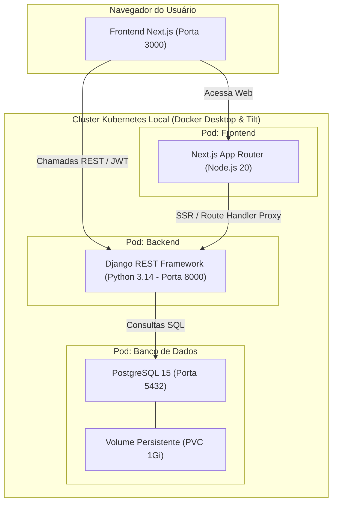

# 🏢 O Seu Síndico

[](https://www.python.org/)
[](https://www.djangoproject.com/)
[](https://www.django-rest-framework.org/)
[](https://nextjs.org/)
[](https://react.dev/)
[](https://www.typescriptlang.org/)
[](https://www.postgresql.org/)
[](https://kubernetes.io/)
[](https://tilt.dev/)
[](https://github.com/bnerTT/OSeuSindico)

Plataforma moderna, segura e escalável para **gestão condominial completa**. Integra portaria, fluxo de encomendas, controle de acesso veicular, reservas de áreas comuns e lavanderia compartilhada, oferecendo interfaces dedicadas para a **Administração/Portaria** e para o **Morador**.

---

## 📑 Sumário

- [Visão Geral](#-visão-geral)
- [Funcionalidades Principais](#-funcionalidades-principais)
- [Arquitetura do Projeto](#-arquitetura-do-projeto)
- [Stack Tecnológica](#-stack-tecnológica)
- [Estrutura de Diretórios](#-estrutura-de-diretórios)
- [Como Executar Localmente](#-como-executar-localmente)
  - [Modo 1: Orquestração Local com Tilt & Kubernetes (Recomendado)](#modo-1-orquestração-local-com-tilt--kubernetes-recomendado)
  - [Modo 2: Execução Manual dos Serviços](#modo-2-execução-manual-dos-serviços)
- [Variáveis de Ambiente](#-variáveis-de-ambiente)
- [Documentação da API (Swagger & RAG)](#-documentação-da-api-swagger--rag)
- [Testes Automatizados & Qualidade](#-testes-automatizados--qualidade)
- [Segurança & Boas Práticas](#-segurança--boas-práticas)

---

## 🎯 Visão Geral

O projeto **O Seu Síndico** foi estruturado no formato de **Monorepo Modular**, separando com clareza as responsabilidades entre:
- **`backend/`**: API RESTful completa em Django, autenticação JWT, documentação OpenAPI com Swagger e ORM PostgreSQL.
- **`frontend/`**: Aplicação Next.js 16 (App Router) moderna, responsiva e performática construída com Tailwind CSS v4 e componentes Shadcn / Base UI.
- **`infra/`**: Definições de contêineres e orquestração declarativa para Kubernetes local automatizada via **Tilt** (com *Live Update* em tempo real sem necessidade de recriar pods).

---

## ✨ Funcionalidades Principais

### 🛡️ Administração & Portaria (`/admin/*`)
- **Gestão de Moradores:** Cadastro, atualização e listagem de moradores com unidade/apartamento e mascaramento LGPD de CPF (`***.456.789-**`).
- **Controle de Encomendas:** Registro ágil na chegada de pacotes e baixa com um clique no momento da retirada.
- **Identificação Veicular:** Consulta instantânea por placa ou número de apartamento para liberação rápida de portão e vagas.
- **Áreas Comuns:** Cadastro de espaços (salão de festas, churrasqueira, quadra) e supervisão das reservas do condomínio.
- **Lavanderia Coletiva:** Catálogo de máquinas, horários de funcionamento e cancelamento/baixa de agendamentos.

### 👤 Portal do Morador (`/morador/*`)
- **Minha Unidade:** Visualização dos dados do perfil associado e resumo das atividades.
- **Minhas Encomendas:** Alertas visuais de pacotes aguardando retirada na portaria e histórico completo de recebimentos.
- **Meus Veículos:** Consulta aos veículos cadastrados sob a sua titularidade.
- **Reservas de Áreas:** Agendamento com validação de datas futuras e prevenção de conflitos de horário em tempo real.
- **Reserva de Máquinas de Lavar:** Seleção de máquinas disponíveis com bloqueio de sobreposição de horários.

---

## 🏛️ Arquitetura do Projeto



---

## 🛠️ Stack Tecnológica

| Camada | Tecnologias Principais |
|---|---|
| **Back-end** | Python 3.14, Django 6.1.1, Django REST Framework 3.18.1, SimpleJWT 5.5.1, drf-spectacular (OpenAPI 3 / Swagger), Gunicorn, Poetry |
| **Front-end** | Next.js 16.3.3 (Turbopack, App Router), React 19, TypeScript 5.7, Tailwind CSS v4, Lucide React, Base UI / Shadcn UI |
| **Banco de Dados**| PostgreSQL 15, Driver psycopg2-binary |
| **Infraestrutura**| Kubernetes (Deployments, Services, ConfigMaps, Secrets, PVC), Tilt 0.37+, Docker, Docker Compose |
| **CI/CD** | GitHub Actions (AWS ECR, Amazon EC2 via SSH) |

---

## 📁 Estrutura de Diretórios

```text
OSeuSindico/
├── Tiltfile                       # Orquestrador local com Live Update e Port-Forwards
├── Dockerfile                     # Dockerfile raiz utilizado no pipeline de deploy CI/CD
├── docker-compose.yml             # Orquestração local simplificada via Docker Compose
├── API_DOCUMENTATION_RAG.md       # Contratos detalhados para indexação vetorial (RAG) e front-end
├── AGENTS.md                      # Memória compartilhada entre agentes de IA
│
├── backend/                       # Módulo Back-end (Django REST Framework)
│   ├── src/
│   │   ├── accounts/              # Autenticação, perfis e moradores
│   │   ├── veiculos/              # Gestão de veículos e placas
│   │   ├── encomendas/            # Controle de pacotes da portaria
│   │   ├── areas/                 # Áreas comuns e agendamentos
│   │   ├── lavanderia/            # Máquinas de lavar e reservas
│   │   ├── config/                # Settings, URLs, middleware e WSGI/ASGI
│   │   └── manage.py              # Utilitário CLI do Django
│   ├── pyproject.toml             # Dependências e metadados gerenciados pelo Poetry
│   ├── poetry.lock                # Trava de versões do Python
│   └── .env.example               # Exemplo de variáveis de ambiente do backend
│
├── frontend/                      # Módulo Front-end (Next.js 16 + React 19)
│   ├── app/                       # Rotas App Router (/admin, /morador, /login, api/proxy)
│   ├── components/                # Componentes reutilizáveis e design system
│   ├── contexts/                  # AuthContext com controle estrito de RBAC
│   ├── lib/                       # Cliente de API com auto-refresh JWT e tipagens
│   ├── public/                    # Assets estáticos e ícones
│   ├── package.json               # Dependências Node.js
│   └── .env.example               # Exemplo de variáveis de ambiente do frontend
│
└── infra/                         # Módulo de Infraestrutura & Kubernetes
    ├── docker/
    │   ├── backend.Dockerfile     # Container Django otimizado para hot-reload no Tilt
    │   └── frontend.Dockerfile    # Container Next.js otimizado para dev server
    └── k8s/
        ├── postgres.yaml          # Secret, PVC, Deployment e Service do banco
        ├── backend.yaml           # ConfigMap, Secret, Deployment e Service da API
        └── frontend.yaml          # ConfigMap, Deployment e Service do front-end
```

---

## 🚀 Como Executar Localmente

### Modo 1: Orquestração Local com Tilt & Kubernetes (Recomendado)

O **Tilt** é o orquestrador padrão do projeto para desenvolvimento local no Kubernetes. Ele gerencia o ciclo de vida dos pods, compila as imagens automaticamente e atualiza o código em tempo real (**Live Update** sem recriar pods).

#### Pré-requisitos:
1. [Docker Desktop](https://www.docker.com/products/docker-desktop/) instalado com o **Kubernetes ativado** (*Settings > Kubernetes > Enable Kubernetes*).
2. [Tilt CLI](https://docs.tilt.dev/install.html) instalado.
3. [kubectl](https://kubernetes.io/docs/tasks/tools/) instalado e apontando para o contexto local:
   ```bash
   kubectl config use-context docker-desktop
   ```

#### Iniciando o ambiente:
Na raiz do repositório, execute:

```bash
tilt up
```

Pressione a barra de **espaço** para abrir o dashboard web interativo do Tilt em:
👉 **[http://localhost:10350](http://localhost:10350)**

#### Serviços e Portas Mapeadas Automaticamente:
- 🌐 **Frontend (Next.js):** [http://localhost:3000](http://localhost:3000)
- ⚙️ **Backend API (Django):** [http://localhost:8000](http://localhost:8000)
- 📑 **Swagger UI:** [http://localhost:8000/api/docs/](http://localhost:8000/api/docs/)
- 🗄️ **PostgreSQL:** `localhost:5432` (`usuário: postgres`, `senha: postgres`)

> **⚡ Vantagem do Live Update:** Ao salvar um arquivo em `backend/src/` ou `frontend/app/`, as alterações são sincronizadas para dentro do pod em milissegundos sem reiniciar o container.

---

### Modo 2: Execução Manual dos Serviços

Se preferir rodar os serviços diretamente na sua máquina hospedeira sem Kubernetes:

#### 1. Banco de Dados (PostgreSQL)
Inicie uma instância local do Postgres ou use o Docker:
```bash
docker run -d --name postgres-dev -p 5432:5432 -e POSTGRES_PASSWORD=postgres -e POSTGRES_DB=postgres postgres:15-alpine
```

#### 2. Backend (Django)
```bash
cd backend

# Crie o .env a partir do modelo
cp .env.example .env

# Instale as dependências via Poetry
poetry install

# Aplique as migrações no banco
poetry run python src/manage.py migrate

# Inicie o servidor local
poetry run python src/manage.py runserver 0.0.0.0:8000
```

#### 3. Frontend (Next.js)
Em outro terminal:
```bash
cd frontend

# Crie o .env a partir do modelo
cp .env.example .env

# Instale as dependências
npm install

# Inicie o servidor de desenvolvimento
npm run dev
```

---

## 🔑 Variáveis de Ambiente

### Backend (`backend/.env`)
| Variável | Valor Padrão (Local) | Descrição |
|---|---|---|
| `DB_NAME` | `postgres` | Nome do banco de dados |
| `DB_USER` | `postgres` | Usuário do banco |
| `DB_PASSWORD` | `postgres` | Senha do banco |
| `DB_HOST` | `localhost` (ou `db` no k8s) | Host de conexão do Postgres |
| `DB_PORT` | `5432` | Porta do banco |
| `DJANGO_SECRET_KEY` | `chave-de-desenvolvimento` | Chave criptográfica do Django |
| `DEBUG` | `True` | Modo de depuração (False em produção) |
| `ALLOWED_HOSTS` | `127.0.0.1,localhost,testserver,backend` | Hosts permitidos |
| `CORS_ALLOW_ALL_ORIGINS`| `True` | Habilita requisições CORS do frontend |
| `DB_SSL_ENABLED` | `False` | Força SSL na conexão com o banco (RDS) |

### Frontend (`frontend/.env`)
| Variável | Valor Padrão (Local) | Descrição |
|---|---|---|
| `NEXT_PUBLIC_BASE_URL` | `http://localhost:8000` | URL do backend acessada pelo navegador |
| `NEXT_PUBLIC_API_URL` | `http://localhost:8000` | URL pública da API |
| `BACKEND_INTERNAL_URL` | `http://backend:8000` | Endereço interno no Kubernetes para SSR |

---

## 📖 Documentação da API (Swagger & RAG)

A API do backend é totalmente documentada com o padrão **OpenAPI 3.0** via `drf-spectacular`:

- 🖥️ **Swagger UI Interativo:** Acesse [http://localhost:8000/api/docs/](http://localhost:8000/api/docs/) com o backend em execução para explorar, testar rotas e visualizar esquemas de requisição/resposta em tempo real.
- 📄 **Esquema OpenAPI (JSON/YAML):** [http://localhost:8000/api/schema/](http://localhost:8000/api/schema/)
- 🧠 **Documentação Especial para RAG e IA:** O arquivo [`API_DOCUMENTATION_RAG.md`](./API_DOCUMENTATION_RAG.md) contém uma especificação completa e estruturada semanticamente com todos os endpoints, payloads, queries, interfaces TypeScript e diagramas de fluxo.

---

## 🧪 Testes Automatizados & Qualidade

O backend conta com uma suíte rigorosa de **testes unitários e de integração** cobrindo autenticação, restrições RBAC, validações de reservas e controle de concorrência:

```bash
# Executar todos os testes do backend
cd backend
poetry run python src/manage.py test accounts veiculos encomendas areas lavanderia
```

Resultado da suíte:
```text
Ran 30 tests in ~50s
OK (100% de sucesso)
```

No frontend, a validação de tipagens e build é executada com:
```bash
cd frontend
npm run build
```
*(Compila com sucesso todas as 17 rotas estáticas e dinâmicas da aplicação).*

---

## 🔒 Segurança & Boas Práticas

- **Sem Segredos Expostos:** Chaves de API, senhas e endereços de instâncias remotas foram completamente sanitizados e removidos do código-fonte.
- **Mascaramento LGPD:** Documentos sensíveis de moradores (como CPF) são exibidos com censura de dígitos em toda a interface do usuário.
- **Proteção em Produção:** Pipelines de deploy na AWS rodam estritamente com `DEBUG=False` e variáveis carregadas a partir do cofre de Secrets do GitHub Actions.
- **Controle de Acesso RBAC:** As rotas administrativas e ações de mutação são blindadas contra acessos indevidos de usuários com perfil exclusivo de morador.

---

